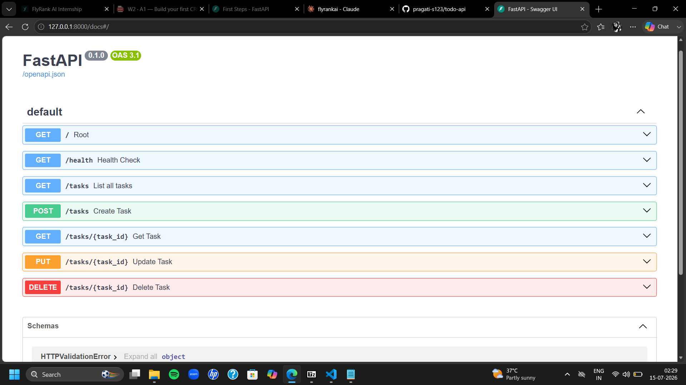

# Task API

A simple CRUD API for managing a to-do list, built with FastAPI as part of the FlyRank Internship — Backend Track, Week 2, Assignment A1.

## What this is

This API lets you create, read, update, and delete tasks. Data is stored in memory (no database yet — that's next week), so it resets when the server restarts.

## How to run it

1. Install dependencies:

pip install fastapi uvicorn

2. Start the server:

uvicorn main:app --reload

3. Visit `http://localhost:8000/docs` to see the interactive Swagger UI.

## Endpoints

| Method | Path            | Description                        |
|--------|-----------------|-------------------------------------|
| GET    | `/`             | API info                           |
| GET    | `/health`       | Health check                       |
| GET    | `/tasks`        | List all tasks                     |
| GET    | `/tasks/{id}`   | Get a single task by id            |
| POST   | `/tasks`        | Create a new task                  |
| PUT    | `/tasks/{id}`   | Update a task's title/done status  |
| DELETE | `/tasks/{id}`   | Delete a task                      |

## Example request

curl.exe -i http://localhost:8000/tasks/1

Response:

HTTP/1.1 200 OK
date: Tue, 14 Jul 2026 19:25:19 GMT
server: uvicorn
content-length: 45
content-type: application/json
{"id":1,"title":"Buy groceries","done":false}

## Swagger UI

All endpoints are documented and testable via "Try it out" at `/docs`.

## Notes

Built stage by stage (Hello Server → Root/Health → Read → Create → Update/Delete → Swagger UI → GitHub publish), with a commit after every stage.
